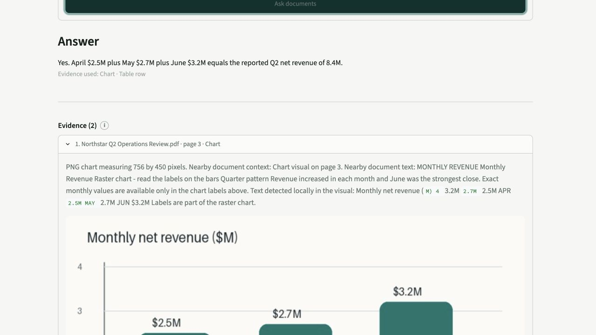
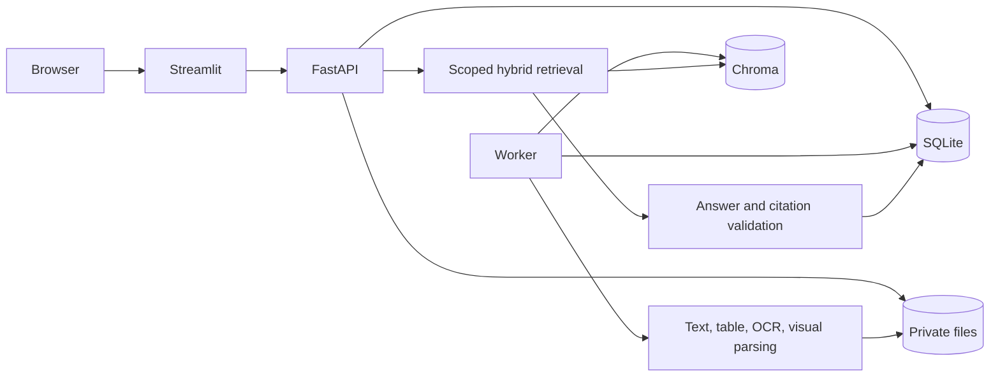

# Document Intelligence

Ask complex PDFs questions and inspect the exact text, table row, chart, diagram, image, or scanned
page behind every answer.

[](https://github.com/ownasquare/multimodal-document-intelligence/actions/workflows/ci.yml)
[](LICENSE)
[](https://www.python.org/downloads/release/python-3120/)



Document Intelligence is a local-first workspace for PDFs that mix prose, tables, charts, images,
diagrams, and scans. The main workflow stays simple:

1. add one or more PDFs;
2. wait while their evidence is prepared;
3. ask a question across a visible document scope; and
4. open the cited evidence to check the answer.

No API key is needed for the included eight-page sample. OpenAI support is optional.

## Try it in 5 minutes

The recommended first run uses Docker, which includes Python, the worker, and Tesseract OCR.

```bash
git clone https://github.com/ownasquare/multimodal-document-intelligence.git
cd multimodal-document-intelligence
docker compose up --build -d
```

Open [http://127.0.0.1:8514](http://127.0.0.1:8514), choose **Create sample workspace**,
and wait for **Preparation** to show **Complete**. Then return to **Ask** and try:

> Do the chart months reconcile to the reported Q2 total?

Open the evidence below the answer to inspect the chart and supporting table. Stop the app with:

```bash
docker compose down
```

See the [Quickstart](docs/quickstart.md) for source installation, OCR notes, reset commands, and
troubleshooting.

## Use your own documents

Open **Documents**, add up to ten PDFs, and ask once they show **Ready**. Files and derived evidence
stay in the local application volume by default. The default deterministic answer mode is intended
for the bundled sample and evidence inspection; enable a multimodal provider for open-ended
reasoning over arbitrary documents.

| Mode | Best for | What leaves the machine |
|---|---|---|
| Deterministic (default) | Trying the product, testing retrieval, inspecting evidence | Nothing is sent to a model provider |
| OpenAI | Open-ended questions and visual reasoning over your PDFs | Only retrieved excerpts and selected page/crop images |

To enable OpenAI, copy `.env.example` to `.env` and set:

```text
DOCINTEL_PROVIDER_MODE=openai
DOCINTEL_EMBEDDING_PROVIDER=openai
DOCINTEL_OPENAI_API_KEY=your-example-key
```

Provider keys remain server-side. Entire PDFs are not uploaded to a persistent provider file store.

## What it understands

- positioned native PDF text and structured tables with
  [pdfplumber](https://github.com/jsvine/pdfplumber);
- page images and visual crops rendered with
  [pypdfium2](https://pypi.org/project/pypdfium2/);
- scanned text through optional [Tesseract OCR](https://tesseract-ocr.github.io/);
- charts, images, and diagrams through a bounded multimodal provider path;
- stable [LlamaIndex](https://docs.llamaindex.ai/) nodes and versioned
  [Chroma](https://docs.trychroma.com/) collections; and
- hybrid semantic, lexical, numeric, modality-aware, and document-scoped retrieval.

Answers cite durable server evidence. Model-selected evidence IDs are validated before citation
metadata is displayed, so generated page labels are never trusted on their own.

## Install from source

Source development requires Python 3.12 and
[uv 0.8.17 or newer](https://docs.astral.sh/uv/). Tesseract 5 is optional but recommended for scans.

```bash
uv sync --all-groups --frozen
make demo
```

`make demo` loads the sample idempotently and starts the API, worker, and UI. Run
`uv run document-intelligence doctor` if startup fails.

Common commands:

| Command | Purpose |
|---|---|
| `make demo` | Start the complete credential-free workspace |
| `make api`, `make worker`, `make ui` | Run the three processes separately |
| `make test` | Run deterministic, network-disabled tests |
| `make check` | Run formatting, lint, types, security, coverage, and build gates |
| `make test-live` | Explicitly opt into provider smoke tests |

## Extend it

Project-owned protocols keep external systems replaceable without leaking SDK details into the
application core.

| Extension | Start here | Registration point |
|---|---|---|
| PDF parser | `DocumentParser` in `ingestion/pipeline.py` | `create_runtime()` in `container.py` |
| Embeddings | `EmbeddingProvider` in `providers/base.py` | `_embedding_provider()` |
| Visual understanding | `VisualUnderstandingProvider` | `_visual_provider()` |
| Answer generation | `AnswerProvider` | `_answer_provider()` |
| Vector store | `VectorIndex` in `ingestion/pipeline.py` | `create_runtime()` |
| Retrieval behavior | `retrieval/planner.py` and `retrieval/reranker.py` | `HybridRetriever` |

The [Extension guide](docs/extending.md) gives the exact files, contracts, tests, and profile rules.
[Contributing](CONTRIBUTING.md) covers the pull-request workflow.

## How it is put together



SQLite is lifecycle authority; Chroma is a retrieval index. Streamlit communicates only with the
typed FastAPI client. Read [Architecture](docs/architecture.md) for lifecycle, concurrency,
retrieval, citation, and scaling details.

## Documentation

- [Quickstart](docs/quickstart.md) — install, first question, stop, reset, troubleshoot
- [Configuration](docs/configuration.md) — environment settings and limits
- [Extension guide](docs/extending.md) — add parsers, providers, indexes, or retrieval behavior
- [API](docs/api.md) — HTTP routes and contracts
- [Operations](docs/operations.md) — backup, restore, recovery, and observability
- [Security and privacy](docs/security.md) — threat boundaries and dependency hardening
- [Validation](docs/validation.md) — tests and honest proof boundaries
- [Contributing](CONTRIBUTING.md), [Support](SUPPORT.md), and [Security policy](SECURITY.md)

## Scope

Version 0.1.0 is a production-style, single-user, single-host application. It does not claim
multi-tenant authorization, horizontal scaling, hosted availability, or a managed production
service. Those require external identity, PostgreSQL, private object storage, a distributed queue,
TLS, and tenant-aware retrieval filters.

## License

[MIT](LICENSE)
